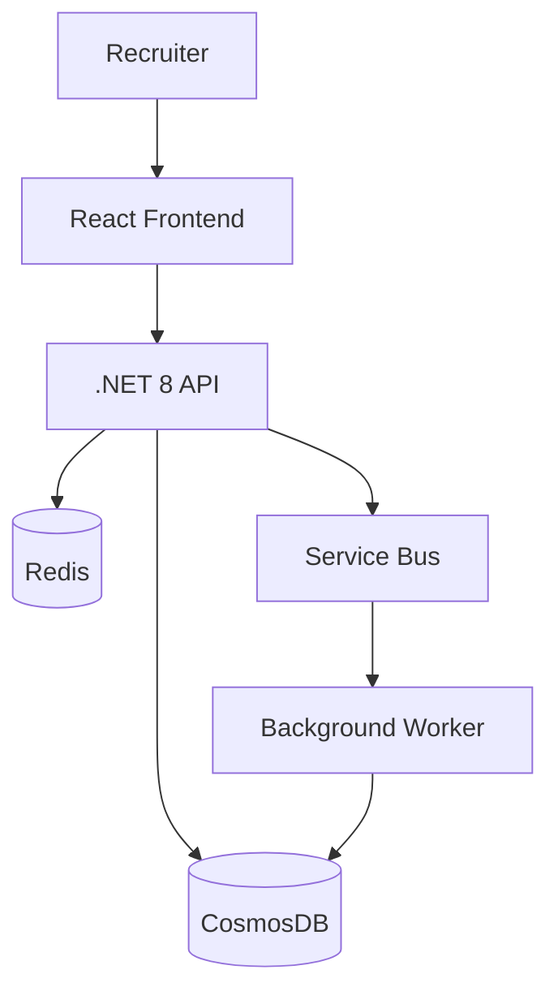
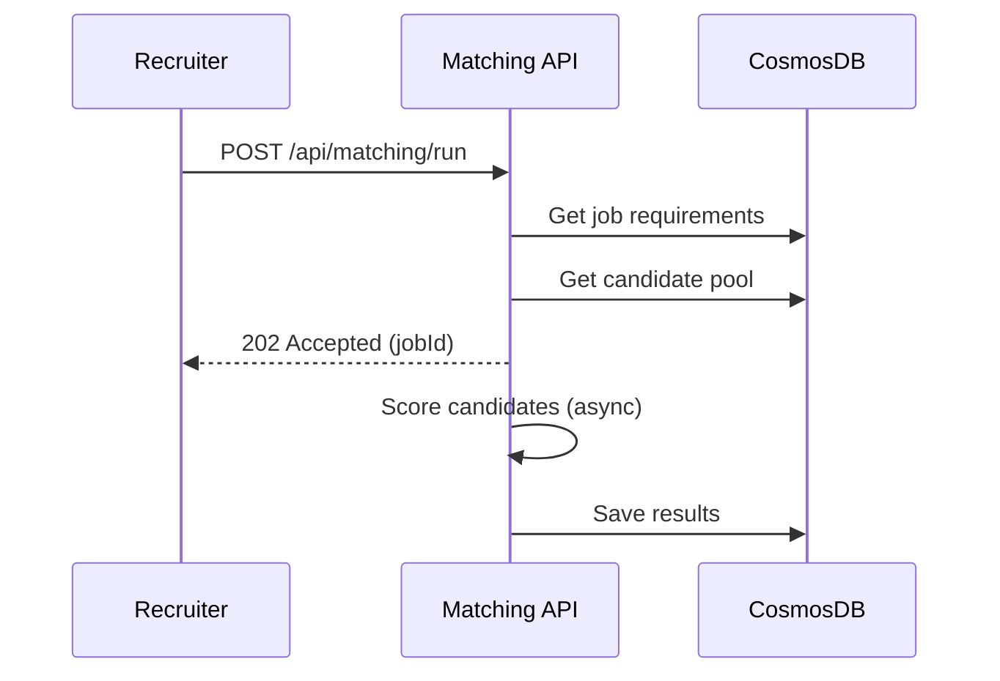

# Architecture Diagrams Guide

---

## C4 Model (4 Levels)

| Level | Shows | Audience |
|-------|-------|----------|
| Context | System + external actors | Everyone |
| Container | Applications, databases, APIs | Developers + architects |
| Component | Internal components of a container | Developers |
| Code | Classes and interfaces | Developers (optional) |

---

## Mermaid (In Markdown)



### Sequence Diagram



---

## PlantUML

```plantuml
@startuml
!include C4_Container.puml
Person(recruiter, "Recruiter")
System_Boundary(sys, "Matching Engine") {
  Container(api, ".NET 8 API", "ASP.NET Core")
  ContainerDb(db, "CosmosDB", "Document DB")
  Container(worker, "Worker", ".NET Background Service")
}
Rel(recruiter, api, "Uses", "HTTPS")
Rel(api, db, "Reads/Writes")
Rel(api, worker, "Enqueues jobs")
Rel(worker, db, "Writes results")
@enduml
```

---

## Best Practices

| Practice | Why |
|----------|-----|
| Use Mermaid in README/docs | Renders in GitHub, GitLab |
| Keep C4 context diagram always current | High-level overview |
| Version diagrams with code | Diagrams-as-code |
| Don't diagram obvious things | Focus on complex interactions |
